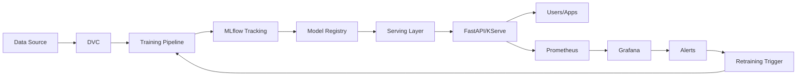

# MLOps Course: 0→1→Production (Commands-First)

## 📋 Course Variables (Defaults)

Throughout this course, we use these variables. Copy-paste and adjust for your environment:

```bash
export CLOUD="local"              # Options: aws|gcp|azure|local
export REGION="us-east-1"
export REGISTRY="ghcr.io/mlops-course"
export BUCKET="mlops-artifacts"
export CLUSTER="mlops-dev"
export NAMESPACE="mlops"
export DB_URL="postgres://mlops:mlops@db:5432/mlops"
export TRACKING_URL="http://mlflow:5000"
export MODEL_NAME="churn-predictor"
export PROJECT="mlops-course"
export PY_VER="3.11"
```

**Save these to `~/.mlops-env`** and source before each session:
```bash
cat > ~/.mlops-env << 'EOF'
export CLOUD="local"
export REGION="us-east-1"
export REGISTRY="ghcr.io/mlops-course"
export BUCKET="mlops-artifacts"
export CLUSTER="mlops-dev"
export NAMESPACE="mlops"
export DB_URL="postgres://mlops:mlops@db:5432/mlops"
export TRACKING_URL="http://mlflow:5000"
export MODEL_NAME="churn-predictor"
export PROJECT="mlops-course"
export PY_VER="3.11"
EOF

source ~/.mlops-env
```

---

## 🎯 Who Is This For?

- **Data Scientists** wanting to operationalize models
- **ML Engineers** building production pipelines
- **DevOps/Platform Engineers** supporting ML workloads
- **Software Engineers** transitioning to ML systems

**Prerequisites**: Basic Python, Docker, Git, and Linux CLI familiarity.

---

## 🎓 Learning Goals

By course end, you will:

1. **Build reproducible ML pipelines** (DVC + MLflow + Airflow)
2. **Version data, code, and models** with traceable lineage
3. **Deploy models as APIs** (FastAPI, KServe) with autoscaling
4. **Monitor drift and performance** (Evidently, Prometheus, Grafana)
5. **Automate CI/CD** for ML with tests, scans, and staged rollouts
6. **Run end-to-end locally** (docker-compose) and on Kubernetes
7. **Respond to incidents** using runbooks and troubleshooting matrices

---

## 📚 Course Structure

### **Phase 1: Foundations (Modules 01–04)**
Build the ML engineering foundation: environments, data versioning, and experiment tracking.

### **Phase 2: Pipelines & Training (Modules 05–07)**
Orchestrate training pipelines, evaluate models, and manage model registry.

### **Phase 3: Serving & Operations (Modules 08–10)**
Deploy models, handle batch/streaming inference, and automate deployments.

### **Phase 4: Production Excellence (Modules 11–14)**
Monitor, detect drift, secure systems, and tie everything together.

---

## 🗺️ Module Map

| Module | Topic | Key Tools |
|--------|-------|-----------|
| **01** | MLOps Foundations | Concepts, roles, lifecycle |
| **02** | Environment & Packaging | uv, poetry, Docker, pre-commit |
| **03** | Data Versioning & Quality | DVC, Great Expectations, Evidently |
| **04** | Experiment Tracking | MLflow (experiments, artifacts) |
| **05** | Pipelines/Orchestration | Airflow, Kubeflow Pipelines |
| **06** | Model Training & Evaluation | Training scripts, metrics, bias checks |
| **07** | Model Registry & Governance | MLflow Registry, stage transitions |
| **08** | Serving & APIs | FastAPI, KServe, BentoML |
| **09** | Batch & Streaming | Batch scoring, Kafka consumers |
| **10** | CI/CD & Environments | GitHub Actions, multi-env deploys |
| **11** | Observability & Monitoring | Prometheus, Grafana, OpenTelemetry |
| **12** | Drift Detection & Retraining | Evidently, automated retraining |
| **13** | Security, Compliance & Cost | SBOM, Trivy, Grype, Gitleaks, PII |
| **14** | Comprehensive Review | End-to-end scenario |

---

## 🏗️ System Architecture (High-Level)



**Key flows:**
- **Training**: DVC pull → train → log to MLflow → register model
- **Serving**: Load from registry → serve via API → collect metrics
- **Monitoring**: Metrics → Prometheus → Grafana → drift alerts → retrigger training

---

## 🚀 How to Practice

### **Option 1: Local (Docker Compose)**
Fastest for learning. Runs on your laptop.

```bash
# Clone the course repo
git clone https://github.com/Dhananjaiah/mlops.git
cd mlops/project

# Start local stack
docker compose up -d

# Verify services
docker compose ps
curl http://localhost:8000/health  # FastAPI
curl http://localhost:5000         # MLflow
curl http://localhost:9090         # Prometheus
curl http://localhost:3000         # Grafana (admin/admin)
```

### **Option 2: Kubernetes (K3d or Minikube)**
Closer to production. Good for testing K8s features.

```bash
# Install K3d (lightweight K8s)
curl -s https://raw.githubusercontent.com/k3d-io/k3d/main/install.sh | bash

# Create cluster
k3d cluster create ${CLUSTER} --servers 1 --agents 2

# Deploy with Kustomize
kubectl create namespace ${NAMESPACE}
kustomize build project/infra/k8s/overlays/dev | kubectl apply -f -

# Port-forward to access services
kubectl port-forward -n ${NAMESPACE} svc/mlflow 5000:5000 &
kubectl port-forward -n ${NAMESPACE} svc/model-api 8000:8000 &
```

### **Option 3: Cloud (AWS/GCP/Azure)**
For production-like experience. Requires cloud account.

See Module 10 (CI/CD) and the `/project/infra/terraform/` for IaC examples.

---

## 📖 How to Use This Course

1. **Read modules sequentially** (01→14)
2. **Run every command** in your terminal (local or K8s)
3. **Complete mini-labs** (5–10 min each) at module end
4. **Take quizzes** to check understanding
5. **Build the capstone project** (Churn Predictor) as you go
6. **Use cheatsheets** (`/cheatsheets/`) for quick reference
7. **Troubleshoot with the matrix** (`/troubleshooting/triage-matrix.md`)
8. **Take mock exams** (`/exams/`) to test readiness

---

## 🛠️ Tooling Baseline (Default Stack)

- **Python env**: `uv` or `poetry` + `pyproject.toml`
- **Pre-commit**: hooks for linting, formatting, secrets
- **Data versioning**: DVC (S3/MinIO/local remote)
- **Experiment tracking**: MLflow (experiments, registry, artifacts)
- **Orchestration**: Airflow (local executor) or Kubeflow Pipelines
- **Serving**: FastAPI (Docker), KServe or BentoML (K8s)
- **Infrastructure**: Terraform (cloud resources), Kustomize/Helm (K8s)
- **Messaging**: Kafka (optional for streaming)
- **Observability**: Prometheus + Grafana, OpenTelemetry traces
- **CI/CD**: GitHub Actions (GitLab variant notes included)
- **Security**: Syft (SBOM), Grype/Trivy (CVE scan), Gitleaks (secrets)

---

## ✅ Success Criteria

By the end, you should:

- ✅ Run `docker compose up` to bring up local MLOps stack
- ✅ Train a model, log to MLflow, register, and deploy via API
- ✅ Query the API and see predictions
- ✅ View metrics in Grafana dashboard
- ✅ Trigger drift alert and see retraining pipeline run
- ✅ Pass security scans (no High/Critical CVEs or leaked secrets)
- ✅ Deploy to dev K8s environment with Kustomize
- ✅ Understand troubleshooting matrix and resolve common issues
- ✅ Complete 2 mock exams with 80%+ score

---

## 🎓 Capstone Project Preview

**Churn Predictor** — a subscription churn prediction system:

- **Data**: Customer demographics, usage logs, churn labels
- **Pipeline**: Ingest → validate → feature engineering → train → evaluate → register → deploy → monitor → retrain on drift
- **Dev**: docker-compose stack (MinIO, MLflow, Postgres, Airflow, FastAPI)
- **Prod**: Kubernetes (KServe/BentoML, external S3, autoscaling, TLS)
- **Testing**: Smoke tests, failure injection (bad schema, drift, missing features)

Full code, configs, and runbooks in `/project/`.

---

## 📚 Additional Resources

- `/cheatsheets/` — Quick reference cards
- `/troubleshooting/` — Triage matrix for common issues
- `/exams/` — Mock certification exams
- `/project/runbook.md` — SRE playbooks

---

## 🚦 Start Here

**Next**: [Module 01 - MLOps Foundations →](01-mlops-foundations.md)

Practice locally first, then move to K8s, then cloud. Commands come first, then short explanations. Verify after every step. Let's build!
