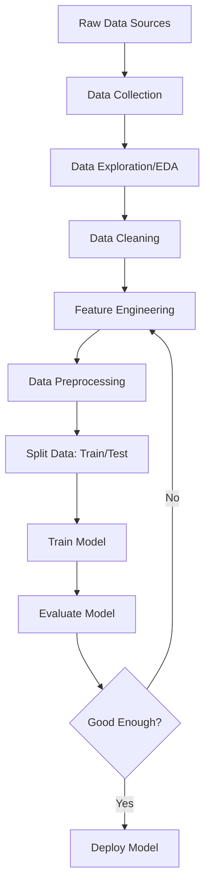

# Module 00.5: Data Engineering for Beginners - A DevOps Engineer's Guide

## 🎯 Module Goals

This module is specifically designed for **DevOps Engineers** or anyone with **no prior data engineering or data science background**. By the end of this module, you will:

- ✅ Understand what data engineering is and why it matters for MLOps
- ✅ Learn how to gather, explore, and understand data
- ✅ Master basic data analysis techniques
- ✅ Create features from raw data (feature engineering)
- ✅ Prepare data for machine learning models
- ✅ Run your first experiments with real data
- ✅ Understand common Python libraries used in data work

---

## 🎓 Who Is This For?

**Perfect for you if:**
- ✅ You're a DevOps engineer who understands CI/CD, Docker, and Kubernetes
- ✅ You know basic Python but haven't worked with data science libraries
- ✅ You can write code but have never built a machine learning model
- ✅ Terms like "feature engineering" and "data preprocessing" sound foreign
- ✅ You want to understand what data scientists do before packaging their work

**What you already know (assumed):**
- Basic Python programming (variables, functions, loops)
- Command line operations (cd, ls, mkdir)
- Git basics (clone, commit, push)
- Docker concepts (images, containers)

---

## 📖 Key Terms Explained Simply

Let's demystify the jargon:

### **Data Engineering**
Think of it as plumbing for data. Just like DevOps engineers build pipelines for code, data engineers build pipelines for data - collecting it, cleaning it, transforming it, and making it available for analysis.

### **Feature**
A feature is just a column in your data that the model uses to make predictions. If you're predicting customer churn, features might be: age, account_balance, days_since_signup.

### **Feature Engineering**
Creating new useful columns from existing ones. For example: if you have "signup_date", you can create "days_as_customer" by calculating the difference from today. This is like preprocessing data in ETL pipelines.

### **Target Variable (Label)**
This is what you're trying to predict. In a churn prediction system, it's whether a customer will leave (1) or stay (0). Think of it as the output you want.

### **Training Data**
Historical data where you already know the answer. You show the model examples: "This customer had these features and they DID churn" or "This customer had these features and DIDN'T churn."

### **Model**
A mathematical function that learns patterns from data. Don't overthink it - it's essentially a smart function that takes inputs (features) and returns outputs (predictions).

### **Exploratory Data Analysis (EDA)**
Looking at your data to understand it before building anything. Like doing a health check on a server before deploying to it.

---

## 🗺️ The Data Journey - A Simple Flowchart



**Think of it like a CI/CD pipeline, but for data:**
1. **Source** (like your Git repo) → Raw data files
2. **Build** (like compiling code) → Clean and transform data
3. **Test** (like unit tests) → Validate data quality
4. **Deploy** (like releasing software) → Use data to train models

---

## 📚 Python Libraries - Your Toolkit Explained

Just like DevOps has Docker, kubectl, and terraform, data engineering has its own essential tools:

### **pandas** - The Excel of Python
```python
import pandas as pd
```
**What it does:** Reads and manipulates data in tables (called DataFrames)
**Why you need it:** Every data task starts with loading data into pandas
**DevOps analogy:** Like `jq` for JSON, but for tables with rows and columns

### **numpy** - Math Operations at Scale
```python
import numpy as np
```
**What it does:** Fast mathematical operations on arrays of numbers
**Why you need it:** Models need numbers, not text. Numpy makes math efficient
**DevOps analogy:** Like shell commands for batch operations (find, xargs)

### **matplotlib & seaborn** - Visualization
```python
import matplotlib.pyplot as plt
import seaborn as sns
```
**What they do:** Create charts and graphs
**Why you need them:** Understanding data requires seeing patterns visually
**DevOps analogy:** Like Grafana for metrics - visualizing makes patterns obvious

### **scikit-learn** - Machine Learning Made Simple
```python
from sklearn.model_selection import train_test_split
from sklearn.preprocessing import StandardScaler
from sklearn.ensemble import RandomForestClassifier
```
**What it does:** Provides pre-built ML algorithms and data tools
**Why you need it:** You don't write models from scratch, you use tested libraries
**DevOps analogy:** Like using nginx instead of writing your own web server

---

## 🔍 Part 1: Data Gathering and Understanding

### What Is Data Gathering?

In MLOps, data comes from various sources:
- **Databases** (PostgreSQL, MySQL) - structured data in tables
- **APIs** (REST endpoints) - real-time data feeds
- **Files** (CSV, JSON, Parquet) - batch data dumps
- **Event streams** (Kafka) - continuous data flow
- **Cloud storage** (S3, GCS) - large datasets

### Your First Data Load - Step by Step

Let's start with the simplest case: loading a CSV file.

**Scenario:** You have customer data in `customers.csv` and need to understand it.

```python
# Import the library
import pandas as pd

# Load data from CSV file
# This is like reading a configuration file, but for tabular data
df = pd.read_csv('data/customers.csv')

# Quick overview - see first 5 rows
# Think of this as 'head' command for data
print(df.head())

# Get basic information about the dataset
# Shows: column names, data types, non-null counts
print(df.info())

# Get summary statistics (mean, std, min, max, etc.)
# Only for numeric columns
print(df.describe())
```

**What just happened?**
1. `pd.read_csv()` - Reads the file and creates a DataFrame (a table in memory)
2. `.head()` - Shows first few rows (like `head -n 5` in Linux)
3. `.info()` - Gives metadata about columns (like `ls -la` shows file details)
4. `.describe()` - Statistics for numeric columns (like `wc` gives word counts)

---

## 📊 Part 2: Exploratory Data Analysis (EDA)

### Why EDA Matters

Before you build anything with data, you need to understand it. This is like:
- Reading logs before debugging a production issue
- Checking server metrics before scaling
- Reviewing code before refactoring

### Step-by-Step EDA

```python
import pandas as pd
import matplotlib.pyplot as plt
import seaborn as sns

# Load the data
df = pd.read_csv('data/customers.csv')

# ========================================
# Step 1: Basic Data Inspection
# ========================================

# Check the shape (rows, columns)
print(f"Dataset shape: {df.shape}")
# Output: Dataset shape: (10000, 15)
# Means: 10,000 customers, 15 columns/features

# Check column names
print(f"Columns: {df.columns.tolist()}")

# Check data types
print(df.dtypes)
# int64 = integer numbers
# float64 = decimal numbers
# object = text/strings

# ========================================
# Step 2: Check for Missing Data
# ========================================

# Count missing values per column
missing = df.isnull().sum()
print("Missing values per column:")
print(missing[missing > 0])

# Visualize missing data
# This is like a health dashboard for your data
plt.figure(figsize=(10, 6))
sns.heatmap(df.isnull(), cbar=False, yticklabels=False)
plt.title('Missing Data Visualization (White = Missing)')
plt.savefig('outputs/missing_data.png')
print("✅ Saved: outputs/missing_data.png")

# ========================================
# Step 3: Understand Distributions
# ========================================

# For numeric columns - see the spread of values
# Example: age distribution
plt.figure(figsize=(10, 6))
df['age'].hist(bins=30)
plt.xlabel('Age')
plt.ylabel('Frequency')
plt.title('Age Distribution of Customers')
plt.savefig('outputs/age_distribution.png')
print("✅ Saved: outputs/age_distribution.png")

# For categorical columns - see the counts
# Example: churn distribution (target variable)
plt.figure(figsize=(8, 6))
df['churned'].value_counts().plot(kind='bar')
plt.xlabel('Churned (0=No, 1=Yes)')
plt.ylabel('Count')
plt.title('Churn Distribution')
plt.savefig('outputs/churn_distribution.png')
print("✅ Saved: outputs/churn_distribution.png")

# ========================================
# Step 4: Find Correlations
# ========================================

# Correlation = how features relate to each other
# Values range from -1 to 1:
#   +1 = perfect positive correlation (both increase together)
#   -1 = perfect negative correlation (one increases, other decreases)
#    0 = no correlation

# Select only numeric columns for correlation
numeric_cols = df.select_dtypes(include=['int64', 'float64']).columns
correlation_matrix = df[numeric_cols].corr()

# Visualize correlations as a heatmap
plt.figure(figsize=(12, 10))
sns.heatmap(correlation_matrix, annot=True, fmt='.2f', cmap='coolwarm', center=0)
plt.title('Feature Correlation Matrix')
plt.tight_layout()
plt.savefig('outputs/correlation_matrix.png')
print("✅ Saved: outputs/correlation_matrix.png")

print("\n🎯 EDA Complete! Check the outputs/ folder for visualizations")
```

**What you learned:**
- How to check data shape and types (like `df -h` for disk space)
- How to find missing values (like checking for null pointers)
- How to visualize distributions (like monitoring dashboards)
- How to find correlated features (like finding dependencies between services)

---

## 🔧 Part 3: Data Cleaning

### Why Clean Data?

Raw data is messy, just like:
- Logs with inconsistent formats
- Config files with different encodings
- User input with typos and special characters

**Common issues:**
- Missing values (null, NaN, empty strings)
- Outliers (age = 150, negative prices)
- Inconsistent formats (dates as strings vs timestamps)
- Duplicate records

### Step-by-Step Cleaning

```python
import pandas as pd
import numpy as np

# Load data
df = pd.read_csv('data/customers.csv')

print(f"Initial shape: {df.shape}")

# ========================================
# Step 1: Handle Missing Values
# ========================================

# Strategy 1: Drop rows with ANY missing values
# ⚠️ Use carefully - you might lose too much data
df_clean = df.dropna()

# Strategy 2: Drop rows with missing values in SPECIFIC columns
# Only drop if critical columns are missing
df_clean = df.dropna(subset=['customer_id', 'signup_date'])

# Strategy 3: Fill missing values with defaults
# For numeric columns - use mean/median/mode
df['age'].fillna(df['age'].median(), inplace=True)
df['income'].fillna(df['income'].mean(), inplace=True)

# For categorical columns - use most common value or "Unknown"
df['country'].fillna('Unknown', inplace=True)

print("✅ Missing values handled")

# ========================================
# Step 2: Remove Duplicates
# ========================================

# Check for duplicate rows
duplicates = df.duplicated().sum()
print(f"Found {duplicates} duplicate rows")

# Remove duplicates (keep first occurrence)
df = df.drop_duplicates()

# Remove duplicates based on specific columns (e.g., customer_id)
df = df.drop_duplicates(subset=['customer_id'], keep='first')

print("✅ Duplicates removed")

# ========================================
# Step 3: Handle Outliers
# ========================================

# Outliers are extreme values that don't make sense
# Example: Age = 150, Transaction amount = -$1000

# Method 1: Remove values outside reasonable range
df = df[(df['age'] >= 18) & (df['age'] <= 100)]
df = df[df['account_balance'] >= 0]

# Method 2: Cap values at percentiles (keep 1st to 99th percentile)
lower = df['transaction_amount'].quantile(0.01)
upper = df['transaction_amount'].quantile(0.99)
df['transaction_amount'] = df['transaction_amount'].clip(lower, upper)

print("✅ Outliers handled")

# ========================================
# Step 4: Fix Data Types
# ========================================

# Convert strings to datetime
df['signup_date'] = pd.to_datetime(df['signup_date'])

# Convert strings to numeric (handle errors)
df['phone_number'] = pd.to_numeric(df['phone_number'], errors='coerce')

# Convert to categorical (saves memory for repeated values)
df['subscription_type'] = df['subscription_type'].astype('category')

print("✅ Data types fixed")

# ========================================
# Step 5: Standardize Values
# ========================================

# Make text consistent
df['country'] = df['country'].str.upper().str.strip()
df['email'] = df['email'].str.lower().str.strip()

# Standardize boolean values
df['is_premium'] = df['is_premium'].map({'yes': 1, 'no': 0, True: 1, False: 0})

print("✅ Values standardized")

print(f"Final shape: {df.shape}")

# Save cleaned data
df.to_csv('data/customers_cleaned.csv', index=False)
print("✅ Cleaned data saved to data/customers_cleaned.csv")
```

**What you learned:**
- Handling missing data (like handling missing config values)
- Removing duplicates (like deduplication in logs)
- Fixing outliers (like filtering invalid metrics)
- Type conversions (like parsing JSON correctly)
- Standardization (like normalizing API responses)

---

## ⚙️ Part 4: Feature Engineering

### What Is Feature Engineering?

Creating new, useful features from existing data. This is where data engineering becomes creative!

**Think of it like:**
- In DevOps: Taking raw logs and creating metrics (request_count, error_rate, p95_latency)
- In System Design: Taking server stats and creating health scores
- In Data: Taking raw columns and creating meaningful predictors

### Real-World Examples

```python
import pandas as pd
import numpy as np
from datetime import datetime

# Load cleaned data
df = pd.read_csv('data/customers_cleaned.csv')

# ========================================
# Pattern 1: Date/Time Features
# ========================================

# Convert to datetime first
df['signup_date'] = pd.to_datetime(df['signup_date'])
df['last_login'] = pd.to_datetime(df['last_login'])

# Extract components from dates
df['signup_year'] = df['signup_date'].dt.year
df['signup_month'] = df['signup_date'].dt.month
df['signup_day_of_week'] = df['signup_date'].dt.dayofweek  # 0=Monday, 6=Sunday

# Calculate time differences
today = pd.Timestamp.now()
df['days_as_customer'] = (today - df['signup_date']).dt.days
df['days_since_last_login'] = (today - df['last_login']).dt.days

print("✅ Date features created")

# ========================================
# Pattern 2: Aggregation Features
# ========================================

# If you have transaction history, aggregate it
# Example: Total spending, average transaction, transaction frequency

# Assuming we have a transactions table
# df['total_spent'] = df.groupby('customer_id')['transaction_amount'].transform('sum')
# df['avg_transaction'] = df.groupby('customer_id')['transaction_amount'].transform('mean')
# df['transaction_count'] = df.groupby('customer_id')['transaction_id'].transform('count')

# ========================================
# Pattern 3: Ratio and Proportion Features
# ========================================

# Create ratios that might be predictive
df['login_frequency'] = df['login_count'] / df['days_as_customer']
df['spend_per_day'] = df['total_spent'] / df['days_as_customer']
df['avg_session_duration'] = df['total_session_time'] / df['login_count']

print("✅ Ratio features created")

# ========================================
# Pattern 4: Binning (Grouping Continuous Values)
# ========================================

# Convert continuous numeric values into categories
# Like grouping HTTP status codes: 2xx, 3xx, 4xx, 5xx

# Age groups
df['age_group'] = pd.cut(df['age'], 
                         bins=[0, 25, 35, 45, 55, 100],
                         labels=['18-25', '26-35', '36-45', '46-55', '55+'])

# Income brackets
df['income_bracket'] = pd.cut(df['income'],
                              bins=[0, 30000, 60000, 100000, np.inf],
                              labels=['Low', 'Medium', 'High', 'Very High'])

print("✅ Binning features created")

# ========================================
# Pattern 5: Categorical Encoding
# ========================================

# Models can't understand text, only numbers
# We need to convert categorical values to numeric

# Method 1: Label Encoding (for ordinal data with order)
from sklearn.preprocessing import LabelEncoder
le = LabelEncoder()
df['subscription_level_encoded'] = le.fit_transform(df['subscription_level'])
# Basic -> 0, Premium -> 1, Enterprise -> 2

# Method 2: One-Hot Encoding (for nominal data without order)
# Creates binary columns for each category
df_encoded = pd.get_dummies(df, columns=['country', 'subscription_type'], 
                             prefix=['country', 'sub_type'])

# Example: country_USA, country_UK, country_Canada (1 or 0)

print("✅ Categorical encoding done")

# ========================================
# Pattern 6: Interaction Features
# ========================================

# Combine features that might interact
df['engagement_score'] = df['login_count'] * df['avg_session_duration']
df['value_score'] = df['total_spent'] * df['days_as_customer']

print("✅ Interaction features created")

# ========================================
# Pattern 7: Text Features (Basic)
# ========================================

# If you have text columns (e.g., customer feedback)
# Extract simple features

# Length of text
df['feedback_length'] = df['customer_feedback'].str.len()

# Word count
df['feedback_word_count'] = df['customer_feedback'].str.split().str.len()

# Contains specific keywords
df['feedback_has_issue'] = df['customer_feedback'].str.contains('problem|issue|bug', 
                                                                 case=False, na=False).astype(int)

print("✅ Text features created")

# Save data with new features
df.to_csv('data/customers_with_features.csv', index=False)
print(f"✅ Final dataset shape: {df.shape}")
print(f"✅ Saved to: data/customers_with_features.csv")
```

**What you learned:**
- Creating time-based features (like calculating uptime)
- Aggregating data (like sum, mean, count)
- Creating ratios (like error rate = errors/total_requests)
- Binning continuous values (like grouping latencies)
- Encoding categories as numbers (like enum values)
- Creating interaction features (like combining metrics)

---

## 🎯 Part 5: Data Preprocessing for Models

### Why Preprocess?

Models expect data in specific formats:
- **All numeric** (no text)
- **Similar scales** (not one feature 0-1, another 0-1000000)
- **No missing values**

Think of it like:
- Containers expect specific base images
- APIs expect specific request formats
- Compilers expect specific syntax

### Step-by-Step Preprocessing

```python
import pandas as pd
import numpy as np
from sklearn.model_selection import train_test_split
from sklearn.preprocessing import StandardScaler, MinMaxScaler
from sklearn.impute import SimpleImputer

# Load data with features
df = pd.read_csv('data/customers_with_features.csv')

# ========================================
# Step 1: Separate Features and Target
# ========================================

# Target (what we want to predict)
y = df['churned']  # 0 or 1

# Features (what we use to predict)
# Remove columns that shouldn't be used for prediction
columns_to_drop = ['customer_id', 'email', 'name', 'signup_date', 
                   'last_login', 'churned', 'customer_feedback']
X = df.drop(columns=columns_to_drop)

print(f"Features shape: {X.shape}")
print(f"Target shape: {y.shape}")

# ========================================
# Step 2: Split Data - Train and Test Sets
# ========================================

# Why split?
# - Train set: Model learns from this (like development environment)
# - Test set: Model evaluated on this (like staging/production environment)
# Never mix them! Test set simulates unseen data

X_train, X_test, y_train, y_test = train_test_split(
    X, y, 
    test_size=0.2,      # 20% for testing, 80% for training
    random_state=42,    # For reproducibility (like setting a seed)
    stratify=y          # Keep same churn ratio in both sets
)

print(f"Training set size: {X_train.shape}")
print(f"Test set size: {X_test.shape}")

# ========================================
# Step 3: Handle Missing Values (Again)
# ========================================

# Even after cleaning, some features might have NaN
# Use scikit-learn's imputer for consistency

imputer = SimpleImputer(strategy='median')  # or 'mean', 'most_frequent'

# Fit on training data (learn the median)
imputer.fit(X_train)

# Transform both train and test (apply the learned median)
X_train = pd.DataFrame(imputer.transform(X_train), 
                       columns=X_train.columns, 
                       index=X_train.index)
X_test = pd.DataFrame(imputer.transform(X_test), 
                      columns=X_test.columns, 
                      index=X_test.index)

print("✅ Missing values imputed")

# ========================================
# Step 4: Feature Scaling
# ========================================

# Why scale?
# Features have different ranges:
#   - age: 18-80
#   - income: 20000-500000
#   - login_count: 1-1000
# Models perform better when features are on similar scales

# Method 1: Standardization (Z-score normalization)
# Transforms to mean=0, std=1
# Use when: Features are normally distributed
scaler = StandardScaler()

# Method 2: Min-Max Scaling
# Transforms to range [0, 1]
# Use when: You need values in specific range
# scaler = MinMaxScaler()

# Fit on training data (learn mean and std)
scaler.fit(X_train)

# Transform both train and test
X_train_scaled = pd.DataFrame(scaler.transform(X_train), 
                              columns=X_train.columns, 
                              index=X_train.index)
X_test_scaled = pd.DataFrame(scaler.transform(X_test), 
                             columns=X_test.columns, 
                             index=X_test.index)

print("✅ Features scaled")

# ========================================
# Step 5: Save Preprocessed Data
# ========================================

# Save training data
X_train_scaled.to_csv('data/X_train.csv', index=False)
y_train.to_csv('data/y_train.csv', index=False)

# Save test data
X_test_scaled.to_csv('data/X_test.csv', index=False)
y_test.to_csv('data/y_test.csv', index=False)

print("✅ Preprocessed data saved")

# ========================================
# Step 6: Save Preprocessing Artifacts
# ========================================

# Save the scaler and imputer for later use in production
import joblib

joblib.dump(scaler, 'models/scaler.pkl')
joblib.dump(imputer, 'models/imputer.pkl')

print("✅ Preprocessing artifacts saved")
print("\n🎉 Data preprocessing complete!")
print("\nNext step: Train a model using this preprocessed data")
```

**What you learned:**
- Separating features from target (like input/output in functions)
- Train/test split (like dev/prod environments)
- Imputing missing values (like default config values)
- Feature scaling (like normalizing metrics to 0-100 scale)
- Saving preprocessing steps (like infrastructure as code)

---

## 🧪 Part 6: Your First Experiment

### What Is an Experiment?

Training a model and seeing how well it performs. Like:
- Running load tests to see if your service can handle traffic
- Deploying to staging to see if everything works
- A/B testing two different implementations

### Step-by-Step: Train Your First Model

```python
import pandas as pd
import numpy as np
from sklearn.ensemble import RandomForestClassifier
from sklearn.metrics import accuracy_score, precision_score, recall_score, f1_score
from sklearn.metrics import confusion_matrix, classification_report
import matplotlib.pyplot as plt
import seaborn as sns
import joblib

# ========================================
# Step 1: Load Preprocessed Data
# ========================================

X_train = pd.read_csv('data/X_train.csv')
y_train = pd.read_csv('data/y_train.csv').values.ravel()
X_test = pd.read_csv('data/X_test.csv')
y_test = pd.read_csv('data/y_test.csv').values.ravel()

print(f"Training on {len(X_train)} samples")
print(f"Testing on {len(X_test)} samples")

# ========================================
# Step 2: Choose and Train a Model
# ========================================

# We'll use Random Forest - a popular, robust algorithm
# Think of it as an ensemble of decision trees voting on the answer

model = RandomForestClassifier(
    n_estimators=100,      # Number of trees in the forest
    max_depth=10,          # Maximum depth of each tree
    random_state=42,       # For reproducibility
    n_jobs=-1              # Use all CPU cores (like parallel processing)
)

print("\n🚀 Training model...")
model.fit(X_train, y_train)
print("✅ Model trained!")

# ========================================
# Step 3: Make Predictions
# ========================================

# Predict on training data (sanity check)
y_train_pred = model.predict(X_train)

# Predict on test data (real evaluation)
y_test_pred = model.predict(X_test)

# Get prediction probabilities (confidence scores)
y_test_proba = model.predict_proba(X_test)[:, 1]  # Probability of class 1 (churned)

print("✅ Predictions made")

# ========================================
# Step 4: Evaluate Performance
# ========================================

# Metrics Explained:
# - Accuracy: % of correct predictions (like uptime %)
# - Precision: Of predicted churners, how many actually churned (quality)
# - Recall: Of actual churners, how many we caught (coverage)
# - F1-Score: Balance between precision and recall

def print_metrics(y_true, y_pred, dataset_name):
    print(f"\n📊 {dataset_name} Metrics:")
    print(f"  Accuracy:  {accuracy_score(y_true, y_pred):.4f}")
    print(f"  Precision: {precision_score(y_true, y_pred):.4f}")
    print(f"  Recall:    {recall_score(y_true, y_pred):.4f}")
    print(f"  F1-Score:  {f1_score(y_true, y_pred):.4f}")

print_metrics(y_train, y_train_pred, "Training Set")
print_metrics(y_test, y_test_pred, "Test Set")

# Detailed classification report
print("\n📋 Detailed Classification Report:")
print(classification_report(y_test, y_test_pred, 
                          target_names=['Not Churned', 'Churned']))

# ========================================
# Step 5: Confusion Matrix
# ========================================

# Shows: True Positives, True Negatives, False Positives, False Negatives
# Like: Expected vs Actual in testing

cm = confusion_matrix(y_test, y_test_pred)

plt.figure(figsize=(8, 6))
sns.heatmap(cm, annot=True, fmt='d', cmap='Blues')
plt.title('Confusion Matrix')
plt.ylabel('Actual')
plt.xlabel('Predicted')
plt.savefig('outputs/confusion_matrix.png')
print("✅ Saved: outputs/confusion_matrix.png")

# ========================================
# Step 6: Feature Importance
# ========================================

# Which features matter most for predictions?
# Like: Which metrics are most important for alerting?

feature_importance = pd.DataFrame({
    'feature': X_train.columns,
    'importance': model.feature_importances_
}).sort_values('importance', ascending=False)

print("\n🔝 Top 10 Most Important Features:")
print(feature_importance.head(10))

# Visualize
plt.figure(figsize=(10, 8))
feature_importance.head(15).plot(x='feature', y='importance', kind='barh')
plt.title('Top 15 Feature Importances')
plt.xlabel('Importance')
plt.tight_layout()
plt.savefig('outputs/feature_importance.png')
print("✅ Saved: outputs/feature_importance.png")

# ========================================
# Step 7: Save the Model
# ========================================

joblib.dump(model, 'models/churn_model.pkl')
print("\n✅ Model saved to: models/churn_model.pkl")

# ========================================
# Step 8: Save Experiment Metadata
# ========================================

experiment_results = {
    'model_type': 'RandomForestClassifier',
    'n_estimators': 100,
    'max_depth': 10,
    'train_samples': len(X_train),
    'test_samples': len(X_test),
    'test_accuracy': float(accuracy_score(y_test, y_test_pred)),
    'test_precision': float(precision_score(y_test, y_test_pred)),
    'test_recall': float(recall_score(y_test, y_test_pred)),
    'test_f1': float(f1_score(y_test, y_test_pred)),
}

import json
with open('outputs/experiment_results.json', 'w') as f:
    json.dump(experiment_results, f, indent=2)

print("✅ Saved: outputs/experiment_results.json")

print("\n🎉 Experiment complete!")
print("\n📊 Summary:")
print(f"  Test Accuracy: {experiment_results['test_accuracy']:.2%}")
print(f"  Test F1-Score: {experiment_results['test_f1']:.4f}")
print("\n✅ Model is ready for deployment!")
```

**What you learned:**
- Training a machine learning model (like compiling code)
- Making predictions (like running the compiled binary)
- Evaluating performance with metrics (like measuring latency/throughput)
- Understanding confusion matrices (like test pass/fail rates)
- Finding important features (like profiling bottlenecks)
- Saving models (like creating container images)

---

## 🚀 Putting It All Together

### The Complete Pipeline

Now that you understand each piece, here's how they fit together:

```bash
# 1. Data Collection
python scripts/01_collect_data.py

# 2. Exploratory Data Analysis
python scripts/02_eda.py

# 3. Data Cleaning
python scripts/03_clean_data.py

# 4. Feature Engineering
python scripts/04_feature_engineering.py

# 5. Data Preprocessing
python scripts/05_preprocessing.py

# 6. Model Training
python scripts/06_train_model.py

# 7. Model Evaluation
python scripts/07_evaluate_model.py
```

Each script is independent and focused, like microservices!

---

## 📦 Quick Start Guide

Want to run everything right now? Follow these steps:

### Prerequisites
```bash
# Create virtual environment
python -m venv .venv
source .venv/bin/activate  # On Windows: .venv\Scripts\activate

# Install dependencies
pip install pandas numpy matplotlib seaborn scikit-learn jupyter
```

### Run the Complete Pipeline
```bash
# Navigate to project directory
cd /home/runner/work/mlops/mlops/project

# Create necessary directories
mkdir -p data/{raw,processed,train,test} models outputs notebooks

# Generate sample data
python scripts/00_generate_sample_data.py

# Run the pipeline
python scripts/run_data_pipeline.py
```

### Explore in Jupyter Notebook
```bash
# Start Jupyter
jupyter notebook

# Open: notebooks/data_engineering_tutorial.ipynb
# Follow along with interactive examples
```

---

## 🎯 Common Mistakes and How to Avoid Them

### Mistake 1: Data Leakage
**What:** Using test data information during training
**Example:** Scaling before splitting (test data statistics influence training)
**Fix:** Always split first, then preprocess

### Mistake 2: Overfitting
**What:** Model memorizes training data but fails on new data
**Analogy:** Like a script that only works with hardcoded values
**Fix:** Use train/test split, cross-validation, regularization

### Mistake 3: Ignoring Data Types
**What:** Treating categorical variables as numeric
**Example:** Encoding countries as 1, 2, 3 implies order (wrong!)
**Fix:** Use one-hot encoding for nominal categories

### Mistake 4: Not Handling Missing Values
**What:** Letting NaN values reach the model
**Result:** Crashes or unpredictable behavior
**Fix:** Explicit imputation or removal

### Mistake 5: Feature Scaling Inconsistency
**What:** Scaling training and test data separately
**Result:** Different scales in production
**Fix:** Fit scaler on training, apply to test and production

---

## 📚 Next Steps

Now that you understand data engineering basics:

1. ✅ **Move to Module 01** - MLOps Foundations
2. ✅ **Start the capstone project** - Build the churn predictor
3. ✅ **Learn data versioning** - DVC (Module 03)
4. ✅ **Track experiments** - MLflow (Module 04)
5. ✅ **Build pipelines** - Airflow (Module 05)

You now have the foundation to understand what data scientists do and how to operationalize their work!

---

## 🔗 Resources for Further Learning

### Free Courses
- **Python for Data Science** - DataCamp
- **Machine Learning Crash Course** - Google
- **Pandas Tutorial** - Official Documentation

### Books
- **Python for Data Analysis** by Wes McKinney (Pandas creator)
- **Hands-On Machine Learning** by Aurélien Géron

### Practice Datasets
- Kaggle Datasets - kaggle.com/datasets
- UCI Machine Learning Repository
- AWS Open Data Registry

---

## ✅ Self-Check: Are You Ready?

Answer these questions to verify your understanding:

1. ✅ Can you load a CSV file and inspect its contents?
2. ✅ Can you identify and handle missing values?
3. ✅ Can you create a new feature from existing columns?
4. ✅ Can you split data into train and test sets?
5. ✅ Can you scale features using StandardScaler?
6. ✅ Can you train a simple model and evaluate it?

If yes to all → **You're ready for the MLOps modules!** 🎉

---

**[Next Module: 01 - MLOps Foundations →](01-mlops-foundations.md)**
