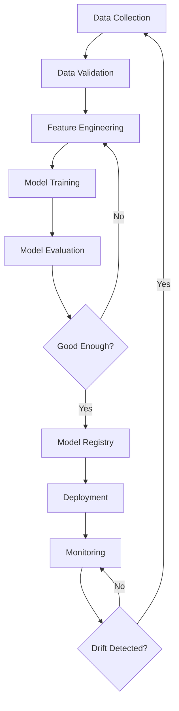

# Module 01: MLOps Foundations

## 🎯 Goals

- Understand **MLOps lifecycle** (data → train → deploy → monitor → retrain)
- Identify **roles** (DS, ML Engineer, Platform Engineer, DevOps)
- Define **ML artifacts** (data, models, code, configs, metrics)
- Recognize **environment parity** (dev vs prod)
- Map **traditional DevOps to MLOps** differences
- Use **basic versioning** for reproducibility

---

## 📖 Key Terms

- **MLOps**: Practices to deploy and maintain ML models in production reliably and efficiently
- **ML Lifecycle**: Iterative loop of data collection → training → deployment → monitoring → retraining
- **Artifact**: Any output from ML process (dataset version, trained model, feature set, metric snapshot)
- **Model Registry**: Central repository for versioned, approved models
- **Drift**: Change in data distribution (data drift) or model performance (concept drift) over time
- **Reproducibility**: Ability to recreate exact training run with same data, code, config, and environment
- **Dev-Prod Parity**: Minimizing differences between development and production environments

---

## 🎓 Lessons with Transcript

### What We're Doing in This Module

**Welcome to MLOps Foundations!** In this foundational lesson, we're establishing the core concepts that will guide your entire MLOps journey. Think of this as building the mental model you'll use throughout the rest of the course.

### Lesson 1: Understanding the MLOps Lifecycle

**Transcript:**
"Let's start with the big picture. When you build a machine learning model, you're not just training it once and forgetting about it. In production, ML is a continuous cycle. You collect data, validate it to make sure it's good quality, engineer features to make your model effective, train the model, evaluate its performance, and if it's good enough, you register it and deploy it to production. But here's the critical part - you don't stop there. You continuously monitor how the model performs with real-world data. When you detect that performance is degrading - what we call 'drift' - you trigger the cycle again. This is fundamentally different from traditional software."

**What you're learning:** How ML systems are iterative, not one-and-done. Each stage feeds into the next, creating a continuous improvement loop.

### Lesson 2: Roles and Responsibilities

**Transcript:**
"MLOps isn't a solo sport. In a mature organization, you'll find four key roles working together. Data Scientists explore data and prototype models - they're the experimenters. ML Engineers take those prototypes and make them production-ready, building pipelines and optimizing performance. Platform Engineers maintain the infrastructure - the Kubernetes clusters, the monitoring systems, the compute resources. DevOps Engineers handle CI/CD, security scanning, and cost optimization. In smaller companies, you might wear multiple hats, but understanding these distinct concerns helps you organize your work effectively."

**What you're learning:** Who does what in an MLOps team, and why each role matters for production ML systems.

### Lesson 3: Artifacts - What to Track and Why

**Transcript:**
"Here's where MLOps diverges sharply from traditional DevOps. In regular software, you version your code and you're mostly done. But in ML, you have to track seven different types of artifacts. Code, yes - your training scripts and serving code. But also your data versions, because the same code with different data produces different models. Your model weights and architecture. Your configuration files - hyperparameters, feature selections. Your metrics - accuracy, latency, everything. Your environment - Python version, library versions. And finally, lineage - what data and code produced what model. If you can't reproduce a training run from three months ago, you can't debug production issues or meet compliance requirements."

**What you're learning:** The expanded scope of version control in ML, and why tracking everything is non-negotiable for production systems.

### Lesson 4: Dev-Prod Parity - The Hidden Killer

**Transcript:**
"Let's talk about what causes most production ML failures. It's not fancy algorithm problems - it's environment mismatches. You train your model on Python 3.11 with pandas 2.1, but production runs Python 3.9 with pandas 1.5. The same code produces different results, or worse, crashes silently. This is why we obsess over lock files and containerization. When dev and prod environments match exactly, your 'works on my machine' problems disappear. We use tools like Docker to ensure that what you test locally is exactly what runs in production."

**What you're learning:** Why environmental consistency is critical, and how mismatches cause silent failures in production.

### Lesson 5: Traditional DevOps vs MLOps

**Transcript:**
"If you come from a software engineering background, you might think 'I already know CI/CD, how hard can this be?' But MLOps adds three game-changing complexities. First, you're not just deploying code - you're deploying stateful data and models. Second, your 'binary' degrades over time as data patterns shift. A perfectly good model from January might be useless by June. Third, deployment isn't just swapping a binary - you need A/B tests, canary deployments, and shadow mode to safely introduce new models. You can't just roll back if something breaks; you need model performance monitoring to detect when something is subtly wrong."

**What you're learning:** The fundamental differences between deploying software and deploying ML systems, and why you need specialized practices.

### Key Definition - What We're Doing Overall

**In this module, we're building your conceptual framework for MLOps.** We're showing you that ML in production is a lifecycle, not a project. We're identifying the different concerns (data, models, code, environment) that you need to manage. We're explaining why reproducibility requires tracking everything. And we're establishing the team structure and roles that make production ML systems successful.

**By the end of this lesson, you should understand:** Why MLOps is necessary (models degrade), what makes it different from DevOps (stateful data, monitoring requirements), who does what (roles), and what you need to track (all seven artifact types). This foundation will make every subsequent module make sense, because you'll understand how each tool and practice fits into the bigger picture.

---

## 🔄 The MLOps Lifecycle



**Key stages:**
1. **Data**: Collect, version, validate quality
2. **Training**: Experiment tracking, hyperparameter tuning
3. **Deployment**: Package, serve, scale
4. **Monitoring**: Performance, drift, latency
5. **Retraining**: Trigger on drift or schedule

---

## 👥 Roles in MLOps

| Role | Responsibilities | Tools |
|------|-----------------|-------|
| **Data Scientist** | Explore data, prototype models, evaluate metrics | Jupyter, pandas, scikit-learn, PyTorch |
| **ML Engineer** | Productionize models, build pipelines, optimize inference | Airflow, MLflow, Docker, Kubernetes |
| **Platform Engineer** | Maintain ML infrastructure, observability, scaling | Terraform, Kubernetes, Prometheus |
| **DevOps Engineer** | CI/CD, security, compliance, cost optimization | GitHub Actions, Trivy, Grafana |

In smaller teams, one person wears multiple hats. In large orgs, these are specialized roles.

---

## 📦 ML Artifacts (What to Track)

```bash
# View example artifacts structure
tree artifacts/
# artifacts/
# ├── data/
# │   ├── raw/
# │   ├── processed/
# │   └── features/
# ├── models/
# │   ├── experiment-123/
# │   │   ├── model.pkl
# │   │   ├── metrics.json
# │   │   └── params.yaml
# ├── configs/
# │   ├── train_config.yaml
# │   └── serve_config.yaml
# └── metadata/
#     └── lineage.json
```

**Must track:**
- **Data**: versions, schemas, statistics
- **Code**: commit SHA, dependencies (requirements.txt, lock files)
- **Models**: weights, architecture, serialization format
- **Configs**: hyperparameters, feature selections
- **Metrics**: accuracy, precision, recall, latency, throughput
- **Environment**: Python version, library versions, OS, hardware

---

## 🔧 Commands First: Setup Baseline Tracking

```bash
# Create project structure with subdirectories
mkdir -p mlops-demo/{data/{raw,processed},models,configs,src,tests}
cd mlops-demo

# Initialize git
git init
git config user.name "MLOps Learner"
git config user.email "learner@mlops.dev"

# Create .gitignore
cat > .gitignore << 'EOF'
# Python
__pycache__/
*.py[cod]
.venv/
.env

# Data (track with DVC, not git)
data/raw/*
!data/raw/.gitkeep
data/processed/*
!data/processed/.gitkeep

# Models (track with MLflow/DVC)
models/*.pkl
models/*.h5
models/*.pt

# IDE
.vscode/
.idea/

# OS
.DS_Store
EOF

# Add .gitkeep to preserve empty directories in git
touch data/.gitkeep data/raw/.gitkeep data/processed/.gitkeep models/.gitkeep

# Initial commit
git add .gitignore data/.gitkeep data/raw/.gitkeep data/processed/.gitkeep models/.gitkeep
git commit -m "Initial MLOps project structure"
```

**Why**: Git tracks code, but data/models need specialized tools (DVC, MLflow). This prevents bloating git repos.

---

## ✅ Verify

```bash
# Check repo structure
ls -la
# Should see: .git, .gitignore, data/, models/, configs/, src/, tests/

# Check git status
git --no-pager log --oneline
# Should show: "Initial MLOps project structure"

# Verify .gitignore works
echo "test" > data/raw/sample.csv
git status
# data/raw/sample.csv should NOT be listed (it's ignored)
```

**Expected**: Clean git status, data directory exists but contents ignored.

---

## 🏗️ Traditional DevOps vs MLOps

| Aspect | Traditional DevOps | MLOps |
|--------|-------------------|-------|
| **Artifacts** | Code (Docker images) | Code + Data + Models |
| **Testing** | Unit, integration, e2e | + Model validation, data quality |
| **Deployment** | Replace binary | A/B test, canary, shadow |
| **Monitoring** | Logs, metrics, traces | + Model metrics (accuracy, drift) |
| **Triggers** | Code commit | + Data change, drift alert, schedule |
| **Rollback** | Previous image | Previous model version |
| **Reproducibility** | Git SHA + env | + Data version + random seed |

**Key difference**: MLOps deals with **stateful data** and **degrading models** over time, not just stateless code.

---

## 📏 Dev-Prod Parity (Critical!)

```bash
# BAD: Different Python versions
# Dev: Python 3.11, Prod: Python 3.9 → pandas API breaks

# GOOD: Pin everything with pyproject.toml
cat > pyproject.toml << 'EOF'
[project]
name = "mlops-demo"
version = "0.1.0"
requires-python = ">=3.11"
dependencies = [
    "scikit-learn==1.3.2",
    "pandas==2.1.3",
    "mlflow==2.9.2",
]

[build-system]
requires = ["hatchling"]
build-backend = "hatchling.build"

[tool.hatch.build.targets.wheel]
packages = ["src"]
EOF

# Create a simple Python module structure
mkdir -p src/mlops_demo
cat > src/mlops_demo/__init__.py << 'EOF'
"""MLOps Demo Package"""
__version__ = "0.1.0"
EOF

# Install with uv (fast, reproducible)
pip install uv
uv venv
source .venv/bin/activate
uv pip install -e .

# Lock dependencies
uv pip freeze > requirements-lock.txt
```

**Why**: Different library versions cause silent bugs. Lock files ensure dev = prod.

---

## 🧪 Mini-Lab (10 min)

**Goal**: Practice creating a minimal ML project with version tracking from scratch.

**What's Different**: This mini-lab is a *simplified*, *hands-on practice* version where you'll create a standalone project to reinforce the concepts. Unlike the main `mlops-demo` above (which sets up a full structure), this focuses on the essentials: git versioning, .gitignore, and basic metrics tracking.

**Learning Objectives**:
- Create a project structure independently
- Configure git to ignore generated artifacts (data, models)
- Track code while excluding outputs
- Log metrics in a reproducible way

1. **Create project**:
```bash
mkdir -p ~/mlops-lab-01 && cd ~/mlops-lab-01
git init
```

2. **Add structure**:
```bash
mkdir -p {data,models,src,configs}
cat > .gitignore << 'EOF'
__pycache__/
.venv/
data/*.csv
models/*.pkl
EOF
git add .gitignore && git commit -m "Add .gitignore"
```

3. **Create dummy training script**:
```bash
cat > src/train.py << 'EOF'
import json
from datetime import datetime

def train():
    metrics = {
        "accuracy": 0.87,
        "precision": 0.85,
        "recall": 0.89,
        "timestamp": datetime.now().isoformat(),
        "git_sha": "abc123",  # In real code, get from git
    }
    with open("models/metrics.json", "w") as f:
        json.dump(metrics, f, indent=2)
    print("Model trained. Metrics saved.")

if __name__ == "__main__":
    train()
EOF

python src/train.py
```

4. **Verify metrics**:
```bash
cat models/metrics.json
# Should show accuracy, precision, recall, timestamp, git_sha
```

5. **Track code (not metrics file)**:
```bash
git add src/train.py
git commit -m "Add training script with metrics logging"
```

**Expected output**: `metrics.json` exists but is not committed (git ignores it). Code is versioned. This is the foundation for MLflow integration in Module 04.

---

## ❓ Quiz (5 Questions)

1. **What is the main difference between DevOps and MLOps?**
   - Answer: MLOps must version data and models in addition to code, and handle model performance degradation over time.

2. **Why shouldn't large datasets be committed to Git?**
   - Answer: Git is designed for text files; large binaries bloat the repo and slow operations. Use DVC or similar.

3. **What is "drift" in ML?**
   - Answer: Change in data distribution (data drift) or relationship between features and target (concept drift), causing model degradation.

4. **What does "reproducibility" require?**
   - Answer: Same code version (git SHA), data version, config, random seed, and library versions.

5. **What role productionizes models into pipelines?**
   - Answer: ML Engineer.

---

## ⚠️ Common Mistakes

1. **Committing data/models to Git** → Repo bloat, slow clones.  
   *Fix*: Use `.gitignore` and DVC.

2. **Not pinning dependencies** → "Works on my machine" issues.  
   *Fix*: Use `requirements-lock.txt` or `poetry.lock`.

3. **Skipping metrics logging** → Can't compare experiments.  
   *Fix*: Always log params, metrics, artifacts (Module 04 covers MLflow).

4. **Hardcoding paths/credentials** → Security risk, breaks portability.  
   *Fix*: Use environment variables and secrets management.

5. **Ignoring data versioning** → Can't reproduce training.  
   *Fix*: DVC for data, MLflow for model artifacts (Module 03).

---

## 🛠️ Troubleshooting

**Issue**: "My model works in Jupyter but fails in production."  
→ **Root cause**: Different Python versions, missing dependencies, or hardcoded paths.  
→ **Fix**: Pin dependencies, use relative paths, containerize (Module 02).  
→ **See**: `/troubleshooting/triage-matrix.md` row "Model inference fails in prod"

**Issue**: "Can't reproduce results from last month."  
→ **Root cause**: Data changed, random seed not set, or dependencies updated.  
→ **Fix**: Version data with DVC, set `random_state` in sklearn, pin deps.  
→ **See**: `/troubleshooting/triage-matrix.md` row "Non-reproducible training"

---

## 📚 Key Takeaways

- MLOps extends DevOps with **data + model versioning** and **drift monitoring**
- Track **7 artifacts**: data, code, models, configs, metrics, environment, lineage
- **Roles** collaborate: DS experiments → ML Eng productionizes → Platform scales → DevOps secures
- **Dev-prod parity** prevents "works on my machine" disasters
- **Reproducibility** requires versioning everything: code, data, env, config, seed

---

## 🚀 Next Steps

- **Module 02**: Set up Python environments with `uv`/`poetry`, Docker base images, pre-commit hooks
- **Module 03**: Version datasets with DVC, validate data quality
- **Module 04**: Track experiments with MLflow (params, metrics, models)

**Hands-on**: Continue building the Churn Predictor project structure in `/project/`.

---

**[← Back to Overview](00-overview.md)** | **[Next: Module 02 →](02-env-and-packaging.md)**
