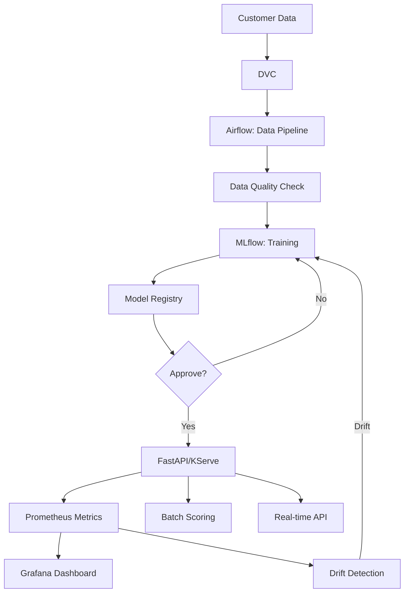

# Module 14: Comprehensive Review

## 🎯 Goals

- **Review** all MLOps concepts from modules 01-13
- Build **end-to-end scenario** connecting all components
- Practice **troubleshooting** real-world issues
- Prepare for **production deployment** checklist
- Understand **career paths** in MLOps
- Plan **continued learning** beyond this course

---

## 🗺️ The Complete MLOps Journey

### **Phase 1: Foundation (Modules 01-04)**

**What you learned:**
- MLOps lifecycle and roles
- Python environments (uv, poetry) and Docker
- Data versioning with DVC
- Experiment tracking with MLflow

**Key commands:**
```bash
# Setup
uv venv && uv pip install -e ".[dev]"
dvc init && dvc remote add -d s3 s3://bucket/dvc
mlflow server --backend-store-uri postgresql://...

# Track experiment
with mlflow.start_run():
    mlflow.log_param("n_estimators", 100)
    mlflow.log_metric("accuracy", 0.95)
    mlflow.sklearn.log_model(model, "model")
```

---

### **Phase 2: Pipelines & Training (Modules 05-07)**

**What you learned:**
- Orchestration with Airflow/Kubeflow
- Systematic training, evaluation, selection
- Model registry and governance

**Key commands:**
```bash
# Airflow DAG
with DAG('train_pipeline', schedule_interval='@daily') as dag:
    load_data >> train >> evaluate >> register

# Model registry
mlflow.register_model("runs:/{run_id}/model", "ChurnPredictor")
client.transition_model_version_stage("ChurnPredictor", "1", "Production")
```

---

### **Phase 3: Serving & Operations (Modules 08-10)**

**What you learned:**
- Serve models with FastAPI/KServe
- Batch scoring and streaming inference
- CI/CD pipelines and multi-environment deployments

**Key commands:**
```bash
# FastAPI serving
@app.post("/predict")
async def predict(request: PredictionRequest):
    model = mlflow.sklearn.load_model("models:/ChurnPredictor/Production")
    return {"predictions": model.predict(request.features).tolist()}

# CI/CD
git push → test → scan → build → deploy-dev → approve → deploy-prod
```

---

### **Phase 4: Production Excellence (Modules 11-13)**

**What you learned:**
- Observability (Prometheus, Grafana, tracing)
- Drift detection and automated retraining
- Security, compliance, cost optimization

**Key commands:**
```bash
# Monitor drift
report = Report(metrics=[DataDriftPreset()])
report.run(reference_data=baseline, current_data=current)

# Security scan
trivy image mlops-api:latest --severity HIGH,CRITICAL --exit-code 1
```

---

## 🏗️ End-to-End Scenario: Churn Predictor

### **Requirements**

Build a production ML system that:
1. Predicts customer churn daily
2. Retrains automatically on drift
3. Serves predictions via API
4. Monitors performance and costs
5. Meets security and compliance standards

### **Architecture**



### **Implementation Checklist**

#### **1. Data & Features (Modules 02-03)**
- [ ] Version data with DVC (S3/MinIO remote)
- [ ] Validate schema with Great Expectations
- [ ] Track data lineage (source, version, timestamp)
- [ ] Monitor data quality metrics daily

#### **2. Training & Experiments (Modules 04-06)**
- [ ] Track experiments in MLflow
- [ ] Log params, metrics, artifacts, model
- [ ] Run cross-validation and hyperparameter tuning
- [ ] Check for bias with fairlearn
- [ ] Select best model based on multiple criteria

#### **3. Model Registry & Governance (Module 07)**
- [ ] Register model with lineage tags
- [ ] Transition: None → Staging → Production
- [ ] Require approval for production
- [ ] Generate model card documentation
- [ ] Automate governance checks

#### **4. Serving (Module 08)**
- [ ] Build FastAPI with /predict, /health, /ready
- [ ] Add request validation (Pydantic)
- [ ] Containerize with Docker
- [ ] Deploy to K8s with autoscaling
- [ ] Add Prometheus metrics

#### **5. Batch & Streaming (Module 09)**
- [ ] Daily batch scoring with Airflow
- [ ] Chunk processing for large datasets
- [ ] Optional: Kafka streaming for real-time
- [ ] Store results in data warehouse

#### **6. CI/CD (Module 10)**
- [ ] GitHub Actions workflow: test → scan → build → deploy
- [ ] Unit tests, integration tests, model tests
- [ ] Security scans (Trivy, Gitleaks, SBOM)
- [ ] Multi-environment (dev, staging, prod)
- [ ] Manual approval for production

#### **7. Observability (Module 11)**
- [ ] Prometheus scrapes /metrics
- [ ] Grafana dashboards (latency, throughput, errors, confidence)
- [ ] Alerts on SLO violations
- [ ] Distributed tracing (OpenTelemetry)
- [ ] Log aggregation (ELK/Loki)

#### **8. Drift & Retraining (Module 12)**
- [ ] Daily drift detection with Evidently
- [ ] Alert on significant drift
- [ ] Automated retraining pipeline
- [ ] Compare new vs old model
- [ ] Promote only if better

#### **9. Security & Compliance (Module 13)**
- [ ] CVE scanning in CI (fail on HIGH/CRITICAL)
- [ ] SBOM generation
- [ ] Secrets scanning (Gitleaks pre-commit)
- [ ] PII detection and anonymization
- [ ] RBAC for K8s and MLflow
- [ ] Cost monitoring and alerts

---

## 🚨 Common Production Issues & Solutions

### **Issue 1: Model Performance Degradation**
**Symptoms**: Accuracy drops, confidence decreases, complaints increase  
**Root causes**: Data drift, concept drift, infrastructure changes  
**Solutions**:
- Check drift detection reports
- Compare current data distribution to baseline
- Retrain with recent data
- A/B test new model vs old

### **Issue 2: API Latency Spike**
**Symptoms**: P95 latency >1s, timeout errors  
**Root causes**: Model too large, no batching, resource contention  
**Solutions**:
- Profile with tracing to find bottleneck
- Optimize model (quantization, pruning)
- Add request batching
- Scale horizontally (more replicas)

### **Issue 3: Training Pipeline Stuck**
**Symptoms**: Airflow task pending, no logs  
**Root causes**: Resource exhaustion, dependency failure, deadlock  
**Solutions**:
- Check Airflow logs, K8s pod status
- Increase memory/CPU limits
- Check for upstream task failures
- Retry or force-rerun

### **Issue 4: Security Scan Failing CI**
**Symptoms**: Trivy reports HIGH/CRITICAL CVE  
**Root causes**: Outdated dependency, vulnerable base image  
**Solutions**:
- Update vulnerable package
- Use minimal base image (distroless)
- Suppress false positives with config
- Contact security team for guidance

### **Issue 5: Cost Spike**
**Symptoms**: Cloud bill doubled  
**Root causes**: Runaway training, no autoscaling down, resource leaks  
**Solutions**:
- Check cost breakdown by service/resource
- Set resource limits and quotas
- Enable autoscaling (min/max replicas)
- Clean up unused resources (old models, data)

---

## 🎓 Career Paths in MLOps

### **1. ML Engineer**
**Focus**: Productionizing models, building pipelines  
**Skills**: Python, ML frameworks, Docker, K8s, Airflow, MLflow  
**Next steps**: Learn cloud platforms (AWS/GCP/Azure), contribute to OSS

### **2. MLOps Platform Engineer**
**Focus**: Building and maintaining ML infrastructure  
**Skills**: Kubernetes, Terraform, CI/CD, observability, security  
**Next steps**: Learn service mesh, GitOps (ArgoCD/Flux), FinOps

### **3. Data Scientist (MLOps-focused)**
**Focus**: Experiments + deployment  
**Skills**: ML algorithms, Python, reproducibility, model governance  
**Next steps**: Learn serving frameworks, A/B testing, causal inference

### **4. DevOps Engineer (ML-focused)**
**Focus**: CI/CD for ML, infrastructure, security  
**Skills**: Docker, K8s, GitHub Actions, monitoring, security scanning  
**Next steps**: Learn ML concepts, model serving, drift detection

---

## 📚 Continued Learning

### **Books**
- *Designing Machine Learning Systems* by Chip Huyen
- *Machine Learning Design Patterns* by Lakshmanan, Robinson, Munn
- *Introducing MLOps* by Treveil et al.

### **Certifications**
- AWS Certified Machine Learning – Specialty
- Google Professional ML Engineer
- Databricks Certified Associate Developer for Apache Spark

### **Communities**
- MLOps Community (mlops.community)
- r/MachineLearning, r/mlops (Reddit)
- ML Discord servers, Slack channels

### **Open Source Projects to Contribute**
- MLflow, DVC, Evidently
- Kubeflow, KServe, BentoML
- Great Expectations, Feast

---

## ✅ Production Readiness Checklist

Before deploying to production:

**Code & Configuration**
- [ ] All secrets in secret manager (not hardcoded)
- [ ] Environment variables for all configs
- [ ] Pre-commit hooks installed and passing
- [ ] Code reviewed and approved

**Testing**
- [ ] Unit tests >80% coverage
- [ ] Integration tests passing
- [ ] Model tests (accuracy, shape, range)
- [ ] Load tests (meets SLO under peak load)

**Security**
- [ ] No HIGH/CRITICAL CVEs
- [ ] SBOM generated
- [ ] No secrets in git history
- [ ] RBAC configured (least privilege)

**Observability**
- [ ] Metrics exposed (/metrics endpoint)
- [ ] Dashboards created in Grafana
- [ ] Alerts configured for SLO violations
- [ ] Logs aggregated centrally

**Operations**
- [ ] Runbook documented (common issues, fixes)
- [ ] On-call rotation defined
- [ ] Incident response plan
- [ ] Backup and disaster recovery tested

**Compliance**
- [ ] Model card documented
- [ ] Data lineage tracked
- [ ] Audit logs enabled
- [ ] GDPR/CCPA compliance verified

---

## 🏆 Final Challenge

**Build the Churn Predictor end-to-end:**
1. Clone the `/project/` directory
2. Run `docker compose up` to start local stack
3. Execute `make train` to train model
4. Execute `make deploy-dev` to deploy to dev
5. Run smoke tests: `make test-smoke`
6. Generate drift, observe alerts
7. Trigger retraining automatically
8. Promote to production with approval

**Success criteria:**
- ✅ Model trained and logged to MLflow
- ✅ API serves predictions with <100ms p95 latency
- ✅ Metrics visible in Grafana
- ✅ Drift detected and retraining triggered
- ✅ Security scans pass
- ✅ All tests green

---

## 🎉 Congratulations!

You've completed the MLOps 0→1→Production course!

**You now know how to:**
- ✅ Version data, code, and models
- ✅ Track experiments and select best models
- ✅ Build automated training pipelines
- ✅ Serve models via APIs with monitoring
- ✅ Detect drift and retrain automatically
- ✅ Deploy with CI/CD to multiple environments
- ✅ Secure and optimize ML systems

**Next steps:**
1. Complete the capstone project (/project/)
2. Take the mock exams (/exams/)
3. Apply learnings to your own projects
4. Share your work and teach others
5. Contribute to open source MLOps tools

---

**Thank you for learning MLOps with us!** 🚀

---

**[← Module 13](13-security-compliance-and-cost.md)** | **[Capstone Project →](/project/README.md)**
