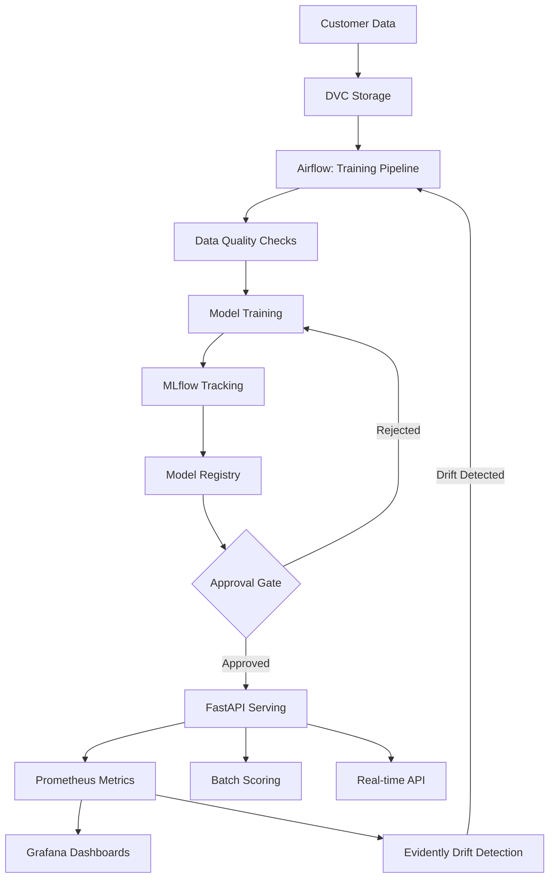

# Capstone Project: Churn Predictor

> 💡 **Looking for step-by-step execution instructions?** See the [**Project Execution Guide**](../PROJECT_EXECUTION_GUIDE.md) for detailed instructions!

## 🎯 Overview

**Churn Predictor** is a complete end-to-end MLOps system for predicting customer churn. It demonstrates all concepts from the MLOps course in a production-ready implementation.

### Features
- ✅ Data versioning with DVC
- ✅ Experiment tracking with MLflow
- ✅ Automated training pipelines (Airflow)
- ✅ Model registry and governance
- ✅ REST API serving (FastAPI)
- ✅ Batch scoring
- ✅ Drift detection and automated retraining
- ✅ Observability (Prometheus + Grafana)
- ✅ CI/CD (GitHub Actions)
- ✅ Security scanning and SBOM
- ✅ Multi-environment deployments (dev/staging/prod)

---

## 🏗️ Architecture



---

## 🚀 Quick Start (Local)

### Prerequisites
- Docker & Docker Compose
- Python 3.11+
- Git

### 1. Clone and Setup
```bash
git clone https://github.com/Dhananjaiah/mlops.git
cd mlops/project

# Copy environment variables
cp .env.example .env

# Source variables
source .env
```

### 2. Start Local Stack
```bash
# Start all services
docker compose up -d

# Verify services
docker compose ps

# Check health
curl http://localhost:8000/health  # FastAPI
curl http://localhost:5000         # MLflow
curl http://localhost:9090         # Prometheus
curl http://localhost:3000         # Grafana (admin/admin)
```

### 3. Initialize Data
```bash
# Generate sample data
python scripts/generate_data.py

# Initialize DVC
dvc init
dvc remote add -d local /tmp/dvc-remote
dvc add data/raw/customers.csv
dvc push
```

### 4. Train Model
```bash
# Option 1: Direct training
python src/train.py

# Option 2: Via Airflow
# Open http://localhost:8080 (admin/admin)
# Trigger "train_churn_model" DAG
```

### 5. Test API
```bash
# Make prediction
curl -X POST http://localhost:8000/predict \
  -H "Content-Type: application/json" \
  -d '{
    "features": [
      [34, 12, 65.5],
      [45, 24, 89.0]
    ]
  }'

# Expected response:
# {"predictions": [0, 0], "model_version": "1.0"}
```

### 6. View Monitoring
```bash
# Grafana dashboards
open http://localhost:3000

# Prometheus metrics
open http://localhost:9090

# MLflow experiments
open http://localhost:5000
```

---

## 📁 Project Structure

```
project/
├── data/                        # Data directory (DVC tracked)
│   ├── raw/                     # Raw customer data
│   ├── processed/               # Preprocessed features
│   └── scored/                  # Batch predictions
├── features/                    # Feature definitions (optional)
│   └── customer_features.py
├── src/                         # Source code
│   ├── train.py                 # Training script
│   ├── preprocess.py            # Data preprocessing
│   ├── api.py                   # FastAPI serving
│   ├── batch_score.py           # Batch scoring
│   └── detect_drift.py          # Drift detection
├── serving/                     # Serving configs
│   ├── Dockerfile.api
│   └── kserve-inference.yaml
├── pipelines/                   # Orchestration
│   ├── airflow/
│   │   └── train_pipeline.py
│   └── kubeflow/
│       └── train_pipeline.py
├── models/                      # Model artifacts (DVC/MLflow tracked)
├── infra/                       # Infrastructure as code
│   ├── terraform/
│   │   ├── main.tf
│   │   └── variables.tf
│   └── k8s/
│       ├── base/
│       │   ├── deployment.yaml
│       │   └── service.yaml
│       └── overlays/
│           ├── dev/
│           └── prod/
├── tests/                       # Tests
│   ├── unit/                    # Unit tests
│   ├── integration/             # Integration tests
│   └── model/                   # Model quality tests
├── scripts/                     # Utility scripts
│   ├── generate_data.py         # Generate sample data
│   ├── seed_db.py               # Seed databases
│   ├── smoke_test.sh            # Smoke tests
│   └── inject_failure.py        # Failure injection for testing
├── configs/                     # Configuration files
│   ├── model_config.yaml
│   └── environments/
│       ├── dev.yaml
│       ├── staging.yaml
│       └── prod.yaml
├── notebooks/                   # Jupyter notebooks (exploration)
├── runbook.md                   # SRE playbook
├── docker-compose.yml           # Local development stack
├── .env.example                 # Environment variables template
├── pyproject.toml               # Python dependencies
├── requirements-lock.txt        # Locked dependencies
├── Makefile                     # Common commands
└── README.md                    # This file
```

---

## 🔧 Development

### Setup Development Environment
```bash
# Create virtual environment
python -m venv .venv
source .venv/bin/activate  # On Windows: .venv\Scripts\activate

# Install dependencies
pip install -e ".[dev]"

# Install pre-commit hooks
pre-commit install

# Run tests
pytest tests/ -v

# Run linters
black src/ tests/
ruff check src/ tests/
mypy src/
```

### Run Individual Components

#### Training
```bash
python src/train.py \
  --model-type rf \
  --n-estimators 100 \
  --max-depth 5
```

#### API Server
```bash
uvicorn src.api:app --reload --host 0.0.0.0 --port 8000
```

#### Batch Scoring
```bash
python src/batch_score.py \
  data/raw/customers.csv \
  data/scored/predictions.csv
```

#### Drift Detection
```bash
python src/detect_drift.py \
  data/baseline.csv \
  data/current.csv
```

---

## 🐳 Docker Commands

```bash
# Build images
docker build -f serving/Dockerfile.api -t churn-api:latest .
docker build -f Dockerfile.train -t churn-train:latest .

# Run training
docker run --rm -v $(pwd)/data:/app/data churn-train:latest

# Run API
docker run -d -p 8000:8000 \
  -e MLFLOW_TRACKING_URI=http://mlflow:5000 \
  churn-api:latest
```

---

## ☸️ Kubernetes Deployment

### Development Environment
```bash
# Create namespace
kubectl create namespace mlops-dev

# Deploy with Kustomize
kubectl apply -k infra/k8s/overlays/dev/

# Verify
kubectl get pods -n mlops-dev
kubectl get svc -n mlops-dev

# Port forward
kubectl port-forward -n mlops-dev svc/mlops-api 8000:80
```

### Production Environment
```bash
# Create namespace
kubectl create namespace mlops-prod

# Deploy with Kustomize
kubectl apply -k infra/k8s/overlays/prod/

# Verify rollout
kubectl rollout status deployment/mlops-api -n mlops-prod

# Check autoscaler
kubectl get hpa -n mlops-prod
```

---

## 🧪 Testing

### Unit Tests
```bash
pytest tests/unit/ -v --cov=src
```

### Integration Tests
```bash
pytest tests/integration/ -v
```

### Model Tests
```bash
pytest tests/model/ -v
```

### End-to-End Smoke Test
```bash
./scripts/smoke_test.sh
```

### Load Testing
```bash
locust -f tests/load/locustfile.py --host=http://localhost:8000
```

---

## 📊 Monitoring

### Metrics
Access Prometheus at http://localhost:9090

Key queries:
```promql
# Prediction rate
rate(predictions_total[5m])

# P95 latency
histogram_quantile(0.95, prediction_latency_seconds_bucket)

# Error rate
rate(api_errors_total[5m])

# Drift alerts
drift_detected
```

### Dashboards
Access Grafana at http://localhost:3000 (admin/admin)

Pre-configured dashboards:
- ML API Performance
- Model Metrics
- Data Drift
- Infrastructure

### Alerts
Check AlertManager at http://localhost:9093

Configured alerts:
- High error rate (>5%)
- High latency (P95 >1s)
- Model not loaded
- Drift detected

---

## 🔄 CI/CD

### GitHub Actions Workflow

Triggers on:
- Push to `main` → Deploy to production
- Push to `develop` → Deploy to dev
- Pull request → Run tests and scans

Stages:
1. **Test**: Unit, integration, model tests
2. **Scan**: Trivy (CVEs), Gitleaks (secrets), SBOM generation
3. **Build**: Docker image build and push
4. **Deploy Dev**: Automatic deployment
5. **Deploy Prod**: Manual approval required

### Manual Deployment
```bash
# Build and push
make docker-build
make docker-push

# Deploy to dev
make deploy-dev

# Deploy to prod (requires approval)
make deploy-prod
```

---

## 🔐 Security

### Pre-deployment Checks
```bash
# Scan for vulnerabilities
trivy image churn-api:latest --severity HIGH,CRITICAL

# Generate SBOM
syft churn-api:latest -o spdx-json=sbom.json

# Scan for secrets
gitleaks detect --source .

# Check dependencies
safety check
```

### RBAC
Kubernetes RBAC configured for:
- `mlops-deployer`: Can deploy to dev
- `mlops-admin`: Can deploy to prod
- `mlops-viewer`: Read-only access

---

## 💰 Cost Optimization

### Resource Limits
```yaml
resources:
  requests:
    cpu: 100m
    memory: 256Mi
  limits:
    cpu: 1
    memory: 1Gi
```

### Autoscaling
```yaml
minReplicas: 2
maxReplicas: 10
targetCPUUtilizationPercentage: 70
```

### Cost Monitoring
- Kubecost for K8s: http://localhost:9003
- Cloud cost alerts configured for $1000/month threshold

---

## 📚 Documentation

- [Runbook](runbook.md) - SRE playbook for incidents
- [API Docs](http://localhost:8000/docs) - OpenAPI/Swagger
- [Model Card](models/model_card.md) - Model documentation
- [Architecture Decision Records](docs/adr/) - Design decisions

---

## 🎓 Learning Objectives

By completing this project, you will:
- ✅ Build end-to-end ML systems from scratch
- ✅ Version data, code, and models
- ✅ Automate training and deployment
- ✅ Monitor models in production
- ✅ Handle drift and retrain automatically
- ✅ Implement security best practices
- ✅ Deploy to Kubernetes with CI/CD
- ✅ Troubleshoot production issues

---

## 🤝 Contributing

1. Fork the repository
2. Create a feature branch
3. Make changes and test
4. Submit pull request with tests and documentation

---

## 📝 License

MIT License - see LICENSE file

---

## 🆘 Support

- Issues: https://github.com/Dhananjaiah/mlops/issues
- Discussions: https://github.com/Dhananjaiah/mlops/discussions
- Slack: MLOps Community

---

## 🎉 Next Steps

1. Complete the end-to-end workflow
2. Experiment with different models
3. Add new features or data sources
4. Deploy to a cloud provider
5. Share your learnings with the community!

**Happy MLOps! 🚀**
